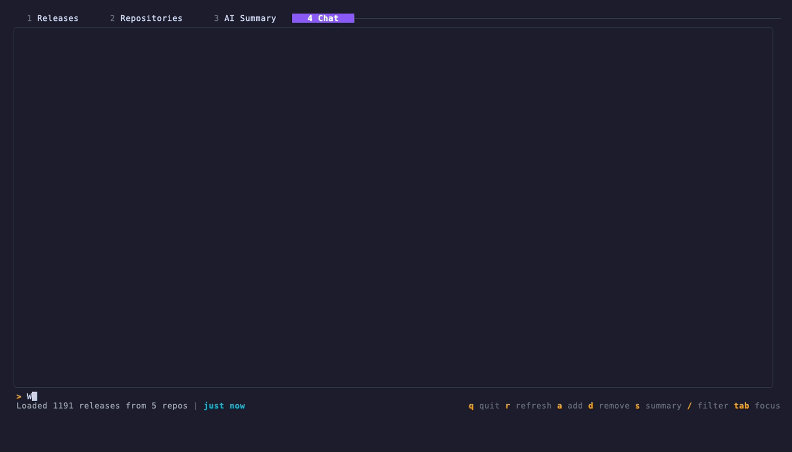

# ReleaseRadar

A terminal UI for tracking GitHub releases across multiple repositories, with AI-powered summaries.



## Features

- Track releases from multiple GitHub repositories
- Split-pane TUI with releases table + detail view
- Repository info panel with stars, forks, language, topics
- Changelog parsing fallback for repos without GitHub Releases
- AI-powered release summaries (OpenAI)
- Interactive AI chat about your tracked releases
- Add/remove repos from within the TUI or via CLI

## Installation

### Homebrew

```bash
brew install wdm0006/tap/releaseradar
```

### From source

```bash
go install github.com/wdm0006/releaseradar/cmd/releaseradar@latest
```

## Prerequisites

GitHub access needs a token from one of two sources, checked in this order:

1. `GITHUB_TOKEN` environment variable — a personal access token with `public_repo`
   (or `repo`, for private repositories). Use this for headless, container, and CI
   environments. When it is set and non-empty, `gh` is not invoked at all.
2. [GitHub CLI](https://cli.github.com) (`gh`) installed and authenticated — the
   token is read from `gh auth token`. Used only when `GITHUB_TOKEN` is unset or empty.

If both are available, `GITHUB_TOKEN` wins.

`OPENAI_API_KEY` is optional and enables the AI summary and chat features.

## Usage

```bash
# Launch the TUI
releaseradar

# Add a repository
releaseradar add owner/repo

# Remove a repository
releaseradar remove owner/repo

# List tracked repositories
releaseradar list
```

## TUI Key Bindings

| Key | Action |
|-----|--------|
| `q` / `Ctrl+C` | Quit |
| `r` | Refresh releases |
| `a` | Add repository |
| `d` / `x` | Remove selected repository |
| `s` | Generate AI summary (on Summary tab) |
| `Ctrl+Left/Right` | Switch tabs |
| `Tab` | Toggle focus between panels |

## Configuration

Tracked repositories are stored as JSON in your OS config directory:

- **Linux:** `$XDG_CONFIG_HOME/releaseradar/config.json` (defaults to `~/.config/releaseradar/config.json`)
- **macOS:** `~/Library/Application Support/releaseradar/config.json`

For backwards compatibility, `~/.releaseradar.json` is read as a legacy fallback when no config file exists at the path above. It is never written to — once you add or remove a repo, the config is saved to the location above and the legacy file is no longer used.

Fetched releases are cached in your OS cache directory so the TUI starts instantly:

- **Linux:** `$XDG_CACHE_HOME/releaseradar/cache.json` (defaults to `~/.cache/releaseradar/cache.json`)
- **macOS:** `~/Library/Caches/releaseradar/cache.json`

Use `releaseradar cache status` to inspect the cache and `releaseradar cache clear` to remove it.

## License

MIT
